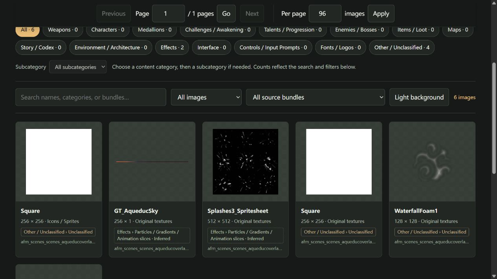

# BrickZhou · Rogue Prince Tools

Two community tools for **The Rogue Prince of Persia**: the **CheatMenu in-game menu** and an **art exporter / offline image library**.

By **BrickZhou/青春啊砖在he边看月亮**

[简体中文](README.md) · [Bilibili](https://space.bilibili.com/517390275) · [YouTube](https://www.youtube.com/@Brickzhou)

> **Windows x64 · Current prerelease: v1.0.0-rc.1.** Back up saves before using CheatMenu. Its new attribution/link area, native gameplay actions and a fresh installation on another PC still need in-game / user-machine verification. [Validation scope](docs/VALIDATION.md)

## Choose your download

| What do you need? | Ready-to-use packages | Next step |
|---|---|---|
| First CheatMenu installation | [CheatMenu 0.1.8][cheat] + [BepInEx download helper][loader] | [Installation guide](docs/INSTALL.en.md#cheatmenu) |
| Update CheatMenu with a compatible loader already installed | [CheatMenu 0.1.8][cheat] | [Update or disable](docs/INSTALL.en.md#update) |
| Only export or browse artwork | [Art Tool 1.1.1][art] | [Art tool setup](docs/INSTALL.en.md#art-tool) |

**The art tool needs neither BepInEx nor a separate Python installation.** Its export EXE and gallery CMD are two entry points for one tool. BepInEx is developed by a third-party team and loads CheatMenu.

[All release files and notes][release] · [SHA-256 checksums][checksums] · [FAQ](docs/FAQ.en.md)

Players should use the packages above. GitHub's **Code → Download ZIP** and the release's **Source code** archives contain developer source files.

## What the tools do

### CheatMenu · Open with F9

- Player: health and energy adjustments, god mode, infinite energy and medallion slot adjustments.
- Resources: separate Add and Set actions; persistent resource and medallion slot actions include save-backup handling.
- Items: browse, search and spawn items near the player. Original levels are **1–5**; higher levels are not guaranteed to work, and level 0 is rejected.
- Vayu's Breath: activate once or keep active.
- Settings: Chinese/English, hotkey, interface scale and position, and author links.

These are the current menu's feature entries; see the compatibility table for native-action verification status. Automatic backups only cover disk saves before selected actions and do not replace a full backup before use.

### Art tool · Export once, browse offline

- Run the EXE to export images and open the gallery in a browser.
- Browse content categories, search names, filter by asset type or source bundle, and switch between Chinese and English.
- Open full-resolution PNGs from thumbnails; reopen existing results with the gallery launcher.
- Supports Sprite, Texture2D and Texture2DArray images. It does not export audio, models, skeletal animations or a complete Unity project.

*Actual Art Tool 1.1.1 interface with 6 images from one sample resource bundle; this is not the full game's image count. Game artwork in the screenshot belongs to its respective rights holders.*

## Quick start

**CheatMenu**

1. Close the game. In Steam, use **Manage → Browse local files** to find its directory. Back up `userdata/saves` inside it.
2. Follow the [prerequisite guide](prerequisites/README.en.md): run the helper, then extract the **original BepInEx archive it downloads**. Start the game, allow initialization to finish, reach the main menu, then exit.
3. Merge the CheatMenu ZIP's `BepInEx` folder into the game directory. Enter a save and press **F9**. Select **设置/setting → 语言/language → English** to switch languages.

[Folder layout, success checks, updates and disabling](docs/INSTALL.en.md#cheatmenu) · [F9 does nothing](docs/FAQ.en.md#f9)

**Art tool**

1. Extract the art package contents beside the game EXE.
2. Run `一键导出美术资源.exe` (export images). Results go to `ArtExports` and the gallery opens when finished.
3. Later, run `打开美术资源库.cmd` (open the library) to view existing results without exporting again.

[Detailed setup and usage](docs/INSTALL.en.md#art-tool) · [Command-line options](art-tool/README.en.md)

## Versions and compatibility

The suite version labels a release; each component keeps its own version number.

| Component | Current version / environment | Verification status |
|---|---|---|
| Suite release | v1.0.0-rc.1 | Prerelease |
| CheatMenu | 0.1.8 | Build and offline logic checks passed; the game was not launched for this release |
| Art tool | 1.1.1 | Portable export and sample-gallery browser checks passed |
| BepInEx | 6.0.0-be.788+5b766a3, Unity.IL2CPP-win-x64 | Pinned official download and checksum verified |
| Reference game environment | Windows x64, game v1.1.0, Steam Build 24299434 | Other platforms and game versions unverified |

First loader initialization may download dependencies. Fresh installation on another player's PC and direct `file://` gallery use across browsers have not been fully verified. [Full validation record](docs/VALIDATION.md)

## Help and development

[FAQ and reporting](docs/FAQ.en.md) · [Report an issue](https://github.com/BrickAZ/rogue-prince-tools/issues/new?template=bug_report.md) · [Build from source](docs/BUILD.en.md) · [Changelog](CHANGELOG.md)

## Author and license

**BrickZhou/青春啊砖在he边看月亮** · [Bilibili](https://space.bilibili.com/517390275) · [YouTube](https://www.youtube.com/@Brickzhou)

Original code uses **GPL-3.0-only**. Commercial redistribution is allowed; comply with corresponding-source and notice requirements. [LICENSE](LICENSE) · [Copyright](COPYRIGHT.md)

CheatMenu includes a [limited game linking permission](cheatmenu/GAME-LINKING-EXCEPTION.txt). BepInEx and other dependencies retain their authors and licenses; see [third-party notices](THIRD-PARTY-NOTICES.md). The tool license does not cover the game or exported artwork. This project is not affiliated with or endorsed by Ubisoft or Evil Empire.

[cheat]: https://github.com/BrickAZ/rogue-prince-tools/releases/download/v1.0.0-rc.1/02-CheatMenu-0.1.8.zip
[loader]: https://github.com/BrickAZ/rogue-prince-tools/releases/download/v1.0.0-rc.1/01-BepInEx-Download-788.zip
[art]: https://github.com/BrickAZ/rogue-prince-tools/releases/download/v1.0.0-rc.1/03-ArtTool-1.1.1.zip
[release]: https://github.com/BrickAZ/rogue-prince-tools/releases/tag/v1.0.0-rc.1
[checksums]: https://github.com/BrickAZ/rogue-prince-tools/releases/download/v1.0.0-rc.1/SHA256SUMS.txt
