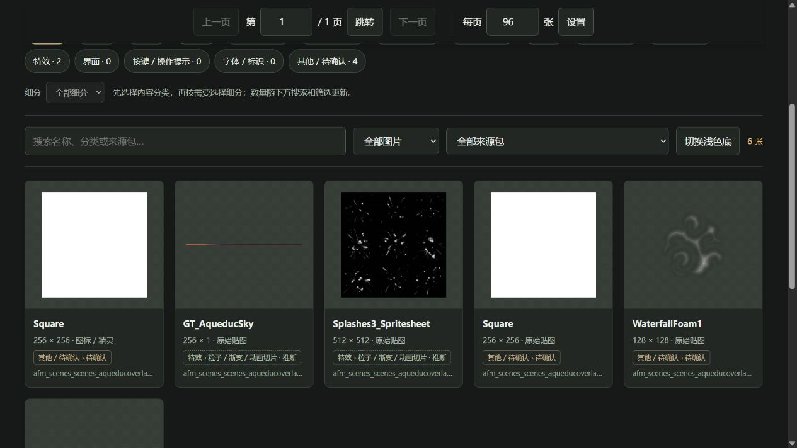

# BrickZhou · Rogue Prince Tools

《The Rogue Prince of Persia》的两个社区工具：**CheatMenu 游戏内菜单**与**美术资源导出 / 离线图片库**。

作者：**BrickZhou/青春啊砖在he边看月亮**

[English](README.en.md) · [B站](https://space.bilibili.com/517390275) · [YouTube](https://www.youtube.com/@Brickzhou)

> **Windows x64 · 当前为预发布 v1.0.0-rc.1。** 使用 CheatMenu 前请备份存档。新菜单署名/链接区域、原生玩法操作及另一台电脑的首次安装仍待实机复核。[验证范围](docs/VALIDATION.md)

## 选择下载

| 我想做什么 | 下载成品包 | 下一步 |
|---|---|---|
| 第一次使用 CheatMenu | [CheatMenu 0.1.8][cheat] + [BepInEx 下载助手][loader] | [完整安装指南](docs/INSTALL.md#cheatmenu) |
| 已有兼容前置，更新 CheatMenu | [CheatMenu 0.1.8][cheat] | [更新与停用](docs/INSTALL.md#update) |
| 只导出或浏览美术图片 | [美术资源工具 1.1.1][art] | [美术工具安装](docs/INSTALL.md#art-tool) |

**美术工具不需要 BepInEx 或额外安装 Python。** 导出 EXE 与查看 CMD 是同一个工具的两个入口。BepInEx 由第三方团队开发，只供 CheatMenu 加载使用。

[全部发布文件与更新说明][release] · [SHA-256 校验文件][checksums] · [常见问题](docs/FAQ.md)

普通玩家下载上表的成品包即可。GitHub 的 **Code → Download ZIP** 和发布页的 **Source code** 是供开发者使用的源码包。

## 两个工具能做什么

### CheatMenu · F9 打开

- 角色：生命、能量相关调整，无敌与无限能量开关，徽章栏位调整。
- 资源：区分增加与设为操作；永久资源和徽章栏位操作带有存档备份机制。
- 物品：浏览、搜索物品，在角色附近生成；原版等级为 **1–5**，更高等级效果未保证，0 级不可用。
- 风神之息：触发一次或持续保持。
- 设置：中英文切换、快捷键、界面缩放与位置，以及作者主页链接。

这些是当前菜单提供的功能入口；各原生操作的实机验证状态见下方兼容表。自动备份只覆盖指定操作前的磁盘存档，不能代替使用前的完整备份。

### 美术资源工具 · 导出后离线查看

- 双击 EXE 导出图片，完成后在浏览器中打开图片库。
- 按内容分类、名称搜索、资源类型和来源包筛选，支持分页与中英文切换。
- 点击缩略图打开原尺寸 PNG；查看入口可重复打开已有结果。
- 支持 Sprite、Texture2D、Texture2DArray 图片；不导出声音、模型、骨架动画或完整 Unity 工程。

*真实界面示例：Art Tool 1.1.1 导出的单个资源包，共 6 张图片；这不是完整游戏资源数量。截图中的游戏美术归原权利人所有。*

## 快速开始

**CheatMenu**

1. 关闭游戏，在 Steam 的“管理 → 浏览本地文件”中找到游戏目录；先备份其中的 `userdata/saves`。
2. 按[前置安装说明](prerequisites/README.md)运行下载助手，再解压它下载的 **BepInEx 原始安装包**。启动游戏完成首次初始化，进入主菜单后退出。
3. 将 CheatMenu ZIP 内的 `BepInEx` 文件夹合并到游戏目录。进入存档后按 **F9**；在 **设置/setting → 语言/language** 切换语言。

[目录示意、安装成功标志、更新与停用](docs/INSTALL.md#cheatmenu) · [F9 没反应](docs/FAQ.md#f9)

**美术资源工具**

1. 将美术工具 ZIP 的内容解压到游戏目录，与游戏 EXE 同级。
2. 双击 `一键导出美术资源.exe`；结果保存至 `ArtExports`，完成后自动打开图片库。
3. 以后双击 `打开美术资源库.cmd` 查看已有结果，无需重新导出。

[详细安装与使用](docs/INSTALL.md#art-tool) · [命令行选项](art-tool/README.md)

## 版本与兼容性

工具集版本是一次发布的标签，各组件保留各自的版本号。

| 项目 | 当前版本 / 环境 | 验证状态 |
|---|---|---|
| 工具集发布 | v1.0.0-rc.1 | 预发布 |
| CheatMenu | 0.1.8 | 构建和离线逻辑测试通过；本次未启动游戏复核 |
| 美术资源工具 | 1.1.1 | 便携导出和样例图片库浏览器检查通过 |
| BepInEx 前置 | 6.0.0-be.788+5b766a3，Unity.IL2CPP-win-x64 | 固定官方包的下载与校验通过 |
| 参考游戏环境 | Windows x64，游戏 v1.1.0，Steam Build 24299434 | 其他平台和游戏版本未确认 |

首次前置初始化可能联网下载依赖。另一台玩家电脑的全新安装，以及图片库在所有浏览器下直接以 `file://` 打开的行为尚未全面验证。[完整验证记录](docs/VALIDATION.md)

## 帮助与开发

[常见问题与反馈](docs/FAQ.md) · [提交问题](https://github.com/BrickAZ/rogue-prince-tools/issues/new?template=bug_report.md) · [源码构建](docs/BUILD.md) · [更新记录](CHANGELOG.md)

## 作者与许可

**BrickZhou/青春啊砖在he边看月亮** · [B站](https://space.bilibili.com/517390275) · [YouTube](https://www.youtube.com/@Brickzhou)

自有代码采用 **GPL-3.0-only**。允许收费；再分发须遵守对应源码、声明保留等要求。[LICENSE](LICENSE) · [版权说明](COPYRIGHT.md)

CheatMenu 附有[有限游戏链接许可](cheatmenu/GAME-LINKING-EXCEPTION.txt)。BepInEx 及其他依赖保留原作者与各自许可证，见[第三方声明](THIRD-PARTY-NOTICES.md)。工具许可不覆盖游戏及导出的美术资源。本项目与 Ubisoft、Evil Empire 无隶属或官方背书关系。

[cheat]: https://github.com/BrickAZ/rogue-prince-tools/releases/download/v1.0.0-rc.1/02-CheatMenu-0.1.8.zip
[loader]: https://github.com/BrickAZ/rogue-prince-tools/releases/download/v1.0.0-rc.1/01-BepInEx-Download-788.zip
[art]: https://github.com/BrickAZ/rogue-prince-tools/releases/download/v1.0.0-rc.1/03-ArtTool-1.1.1.zip
[release]: https://github.com/BrickAZ/rogue-prince-tools/releases/tag/v1.0.0-rc.1
[checksums]: https://github.com/BrickAZ/rogue-prince-tools/releases/download/v1.0.0-rc.1/SHA256SUMS.txt
